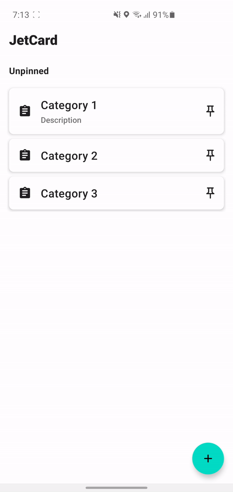
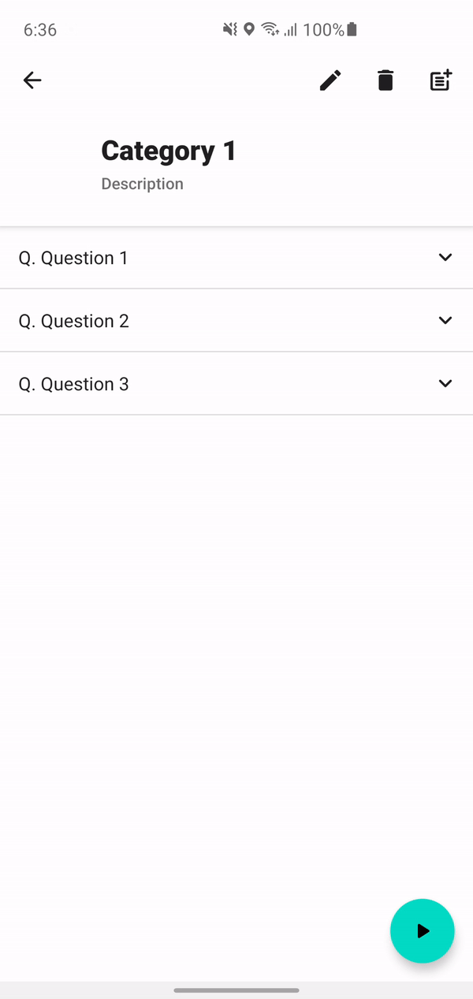

# JetCard

JetCard is simple flash card application using Jetpack Compose

## Preview

  
  
  

## Built with

- Coroutines
- Dagger Hilt
- JetPack
  - Compose
  - LiveData
  - ViewModel
  - Room
  - App Startup

## MAD Scorecard

  

[MAD Scorecard Detail](Scorecard.md)

## Architecture

